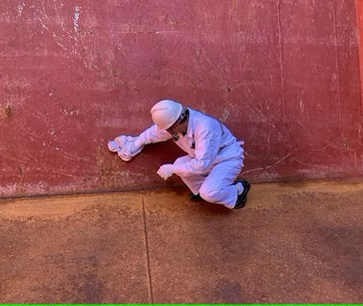

# 
Cargo Holds:  Clean or Dirty?

___
### Problem Statement

Vessel operators have to decide a vessel's next cargo well ahead of knowing the condition her holds will be in when the vessel arrives to load the cargo. The operator may have some knowledge to this problem, such as: the vessel's cargo history, overall condition of her holds coatings from the time of hire, and possibly the crew's experience and capability preparing the vessel's holds. However, the determination of the suitability of her holds is left to an inspector's review of her holds before loading that the vessel operator does not have knowledge of in advance. This uncertainty creates a knowledge gap in the decision making.

**Can vessel operators use an image classification model to quickly get an answer to improve their confidence in determining the cleanliness of the cargo holds coming from a data driven decision instead of relying on intuition?**

___
### Background

The normal workflow to evaluate a vessel's holds is a dynamic and fluid process.  It starts when the vessel is initially hired and her hold conditions are reviewed with her cargo history.  There are two exceptions to the normal workflow, ones for new vessels and vessels leaving drydock.  New vessels, the cargo holds are assumed to be hospital clean with no blemishes whatsoever.  It is possible that the coatings were not applied well, water and or other construction debris infilitrated the holds on her maiden ballast leg, and some other scenarios that could impede this assumption, though highly unliklely.  The other scenario, a vessel leaving drydock, is similar, but deserves separate attention.  The vessel's cargo holds are not always recoated or recoated well.  In some cases, the holds are sandblasted to remove rust and impurities and the sand is not completely or properly removed leaving holds that have not been coated well.  Both of these scenarios fall outside the scope of this model and the process of their evaluation is different.

All other vessels, coming off a previous cargo, have a cargo history.  Each cargo has its own set of characteristics that affect the cleanliness and condition of the holds.  Some can stain (petcoke), leave dust (gypsum), leave hard residues (cement), increase rusting (steel products), and or corrode the coatings and underlying steel (sulphur).  Some leave the holds largely intact and need a good sweeping and rinsing (grains).  Knowing the cargo history is an important step in considering what amount of time, effort, and materials will be needed to prepare the cargo holds for the next cargo.

The crew performance and motivation can also be a determining factor in the holds conditions.  Crews are individual to a vessel and always changing as crew members come and go.  Some are better than others and some are rewarded for their efforts better than others.

The geographical area of where the vessel is unloading her cargo will also impact what cargos are considered next for the vessel.  Some are available within a reasonable distance while others are not.  Cleaning equipment and materials may or may not be readily available to augment those that are on board the vessel.

The vessel operator takes these considerations into account along with the companies overall plan for that vessel and their program.  They might have sent that vessel to a certain area to load another cargo they have already booked for instance.  Others are nearing the end of their hire duration and must be sent in a particular direction for redelivery.  Or they may be allowed or not allowed to carry certain cargoes due to either regulations on the vessel and or restrictions in the charter party.

It is at this moment where the model can assist the vessel operator.  Either before booking the "last cargo" or before booking the "next cargo."  The vessel operator will have pictures of the cargo holds from the last time the vessel was ready to load.  They may have pictures of the holds after it just unloaded depending on where they are in the life cycle of the charter.

For instance, can the vessel get grain clean after petcoke?  How about hospital clean?

### 
Petcoke Last after unloading.

### 
Grain Clean after cleaning

### 
Hospital Clean after paiting

___
### Executive Summary

Dry Bulk cargo is often seen as a leading indicator of the global economy.  The industry comprises the trade of materials that often are required for industrial growth; steel, energy, food, construction, industrial supplies, amongst other commodities.  These bulk cargoes are typically traded in global markets requiring transporation of thousands of miles of tens of thousands of tonnes pf cargo aboard dry bulk cargo vessels.  

The workhorses of this fleet are the handysize, supramax, and ultramax vessels that are capable of transitioning from one cargo to the other. Many times a year, a dry bulk vessel prepares her holds for her next cargo.  Often times, there are various cargos available that require different cleanliness standards.  Depending on several factors from previous cargo, the crew's experience and capability, to the condition of the vessel's holds; there is a lot of uncertainty in how a vessel will meet the standards for the next cargo.

This project aims to reduce that uncertainty by creating a model to assess the conditions of the vessels cargo holds, likelohood to meet the standards of the intended cargoes under consideration, necessary cleaning steps, and provide an evaluation metric for the vessel crew's performance.

The model's performance will be evaluated on accuracy and recall.  Optimizing recall is the metric to focus on to reduce the likliehood of predicting that the vessel's cargo holds are clean when they are not clean.  This will avoid false confidence in booking a cargo and finding out later there are additional costs in time, cleaning materials, and cleaning labor to meet that cleanliness standard.
  
___
### File Directory

* Assets - contains the images in the presentation and this repository as well as two sub directories
    * Presentation
    * Saved models
* Code - this contains thye jupyter notebooks that walks through the project
    * 01_Collection_EDA.ipynb - the initial goals of the projection, data collection and exploration
    * 02_Data_Structure.ipynb - the steps taken to handle the image data and setup the class labels for modeling
    * 03_CNN_Model.ipynb - the first model is a convolutional neural network
    * 04_CNN_Additional_Modeling.ipynb - this model is working with a narrowed dataset
    * 05_Transfer_Learning.ipynb - this model uses VGG16 as the base model
* Data - this directory houses several more directories
    * augmented - contains the augmented images for the train and validation split
    * classified - contains the images from the collected directory into class directories
    * collected - houses the pooled images from all sources
    * false_negatives - contains copies of images identified as false negatives, edge cases
    * selective_data - houses the narrowed dataset for the 04_CNN modeling notebook
    * sources - houses the data coming in from the sources
    * test - contains 10% of the dataset from the classified data BEFORE any augmentation or processing
    * train - contains 80% of the dataset from the augmented directory after processing
    * validate -contains 10% of the dataset from the augmented directory after processing
    * data_eda.csv - contains each image, source, and classifcation
    * data_split.csv - contains each image, source, classification, new_name, and train/validate/test split
* README.md
* requirements.txt - for the virtual environment
___

### Data Dictionary

The data for this project was provided by

Three D's Marine Inc.
https://www.threedsmarine.com/ 

Seachios Marine Services
https://www.seachiosbrazil.com/

Nippon Marine Paint
https://www.international-marine.com/?gad_source=1&gclid=CjwKCAiAmMC6BhA6EiwAdN5iLZcT8F_wvsuv0iw-4Ygjc5Jgk1iIktG-vemoVek1rDzMBJdvb-iKdBoC-uEQAvD_BwE  

The data has been divided into two classes; clean and dirty.
These classes have further segmentations, which for the purpose of this cargo were grouped together:
clean = hosptital clean, grain clean, water wash
dirty = dry sweep, shovel clean, and load on top

The ongoing project, once the data is accumulated, will convert to a mutliclass project.  
___
### Project Workflow

___
### Conclusions

The model's results are only as good as the content the images capture.  If the photo omits critical portions of a cargo hold (chipped paint, cargo residues, etc) the results will be misleading.  It is important that the photos capture the overall condition of the hold as well as highlighting any questionable areas.  It is important to acknowledge that pictures do not capture other variables for a holds inspection, such as dryness and odors.  Holds are to be dry and odor-free.  

It is also important to be reminded that this problem is subjective in nature.  The ultimate determination is left to a human who could form a different opinion from another equally qualified person.

**There is evidence that the dataset is small, but possibly not too small.  A complex and deep CNN model was overfit to the data while a simple CNN model was not showing signs of overfitting.  Further this model was obtaining matching results on the test set as the training and validation sets.**  

Reviewing the model's performance offers signs of promise.
  
___
##### CNN model training  

##### CNN Confusion Matrix  

True Negatives = 36 (correctly predicted clean)  
False Negatives = 7 (wrongly predicted clean)  
False Positves = 19 (wrongly predicted dirty)  
True Positives = 48 (correctly predicted dirty)   
  

##### CNN ROC AUC Curve  

The question remains in regard to data selection.  This will play a part in the next steps as this project shifts from a binary classification problem to a multiclass with the acquistion of more data.

Even so, there are some factors to bear in mind so as not to place too much confidence in the simple CNN model just yet.  
* The dataset is small and contains a significant portion of synthetic data.
* The images were classified with a mindset to accept more data until the dataset grows.  This mindset has resulted in classifying with less focus on edge cases.
* Tell tales were not scrubbed out, leaving potential data leakage with such a large portion of synthetic data.
* The creation of synthetic data, could also invariably shift an image from one class to the other, if it excludes the dirty portion and magnifies the clean portion of an image.

All in all, the model does show promise.  The false predictions were on edge cases and even one image intentionally planted (a clean image put in a dirty directory).  If given a larger dataset the model seems to be able to grow with it to provide a tool that will provide predictions with associated probabilities that the image meets a class.
___

### Next Steps

* Collect more data.  Vessels can generate thousands of pictures a year of cargo holds.
* Continue to develop the structure to receive, catalogue, and retrain the model.
* Re-evaluate selective data selection and transfer learning once the dataset approaches a reasonable size.
* Prepare the project to shift to a multiclass project.  As discussed there are different hierachial levels to distinguish.
* Prepare the project for object detection.  To highlight and detect problems, not the obvious ones, but the ones that lead to failing inspections
* Continue to prepare the project to interact with users via an web interface as well as an email querying and reply system.
___

### Sources

I can't thank the following companies and individuals for their help and support on this project by providing the data.

Three D's Marine Inc
Seachios Marine Services
Nippon Paint Marine
___
